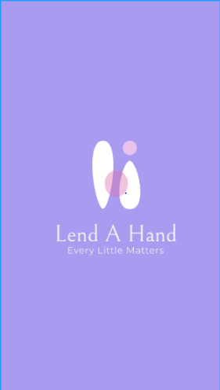
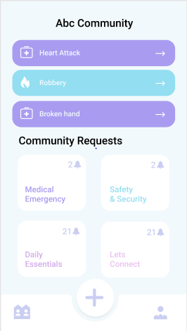
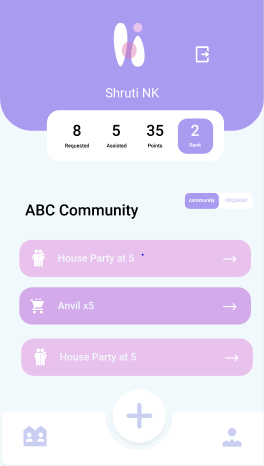
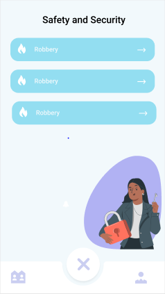

# Lend_A_Hand

## Impact on society

Our app is designed for society. This pandemic had brought life as we know it to a complete standstill and made us question what we had initial taken for granted. In a world where individuality has increased, man still yearns for that social connectivity. In today's world, where even neighbours are unknown to each other, it becomes difficult at times when there is an avoidable situation and staying side by side, along one another is the best remedy or social interaction might be a medicine to a depressed individual or a person having anxiety issues. Senior Citizens might be in need of something very urgent and the ones they know might not be available to help them or there might be some safety, security and societal issues like robbery or harresment which cannot be overcome unless the people are together.

This is where our app steps in. Lend A Hand is a community help app where you can post queries pertaining to anything and everything and receive help from fellow community members. These requests can be anything from high-priority medical emergency ie immediate assistance to a request to meet up at someone's place to reconnect. This is where the community plays an important role.We hope to bring people closer by using our app where they can help each other to grow and strengthen their bonds as a community.

## Contribution of Team members

The entire project was divided based on the technological stacks that each of us had, so Geeth did the mobile application part, Shruti did the complete UI and also helped in the app and Shobhit did the additional backend features incorporated in the app and creation of the APIs used in the app.

## Challenges

The major challenges we faced was:
1. Designing the complete database structure in Firebase backend as our app has a lot of features.
2. Updating the values in real-time in the database and simultaneously in the app which were creating a lot of issues specially since the testing was to be done simultaneously on multiple accounts on our app.
3. Appropriate aadhar card verification and creating an API which in turn uses another API and using it synchronously.

## System Design implementation

Our app is a community help app where in case you have any issue you put a request and someone from the community can assist you. After logging in and authenticating yourself using our aadhar card verification you are directed to a page where you can join a community using a code. After joining a community you can then proceed to either view requests already made by your fellow members or make a request of your own. There are 4 broad categories of a request that are sorted on the basis of priority ie Medical Emergency, Safety and Security, Daily Essentials and Let's Connect. For every person you help, you get points added to your profile over and above which you also have a community leaderboard to see who the best samaritan is. Now in case you want to assist someone, click on the given request card and then you get the further details along with that individual's contact details. Click on accept and you are good to go. Requesting for help is equally simple, all you have to do is click the plus icon and it opens up a page where you can fill the request type and add further details and then you are good to go.

<p align="center">
  
</p>

<p align="center">
  
</p>

<p align="center">
  
</p>

<p align="center">
  
</p>

# Tech Stack
```bash
Flutter
Firebase
Python
Figma
```

**No Libraries and Dependencies** are required for the user, its all been taken care of by us !!!! 
<br>
There are **No Installation Steps** as such only thing the user needs to do is install the app and get connected to the community !!!!
